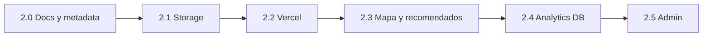

# Plan: Fase 2 — Producción, medios y descubrimiento

**Prerrequisito:** Fase 1 datos completada (catalogo, auth, publicar, favoritos, resenas en Supabase). Checklist: [`BUILD_PLAN.md`](BUILD_PLAN.md).

**Objetivo de la fase:** dejar la app lista para un deploy real en Vercel, subir imagenes de forma sostenible, cerrar huecos entre mocks/DB, y pulir mapa + recomendados + metricas para presentaciones.

---

## Revision superficial del repo (mayo 2026)

### Carpetas — OK con matices

| Area | Estado | Nota |
|------|--------|------|
| `app/(marketing\|platform\|auth)` | OK | Route groups coherentes |
| `components/chazas`, `map`, `forms` | OK | Dominio separado de `landing/` |
| `lib/actions/` | OK | 4 acciones; eliminar `.gitkeep` residual |
| `lib/supabase/` | OK | client, server, admin, middleware, env |
| `lib/data/` | OK | mapper + repo Supabase + fallback local |
| `hooks/` | OK | catalogo, favoritos, sesion, deck, analytics |
| `supabase/migrations/` | OK | Una migracion inicial |
| `scripts/seed-demo-chazas.ts` | OK | Idempotente por slug |
| `docs/` | OK | BUILD_PLAN, SUPABASE_SETUP, ARCHITECTURE (tabla rutas desactualizada — actualizar en 2.0) |

**Duplicado menor:** `components/landing/chaza-swiper.tsx` vs `components/chazas/chaza-swiper.tsx` — confirmar cual usa la landing y deprecar el otro en bloque 2.0.

### Dependencias — OK

- **Nucleo:** Next 16, React 19, Tailwind 4, Zod, RHF, Supabase SSR — alineado con el stack.
- **UI:** muchos paquetes `@radix-ui/*` (shadcn); no bloquean; limpieza opcional si `pnpm prune` / auditoria de imports no usados.
- **Scripts:** `tsx` + `dotenv` solo para seed — correcto.
- **`package.json` `name`:** sigue `my-project` — renombrar a `chazasun` en bloque 2.0 (cosmetico).

### Inconsistencias a corregir en esta fase

1. `app/(platform)/chazas/[slug]/page.tsx` — `generateStaticParams` y metadata solo desde `mockChazaCards`; con DB nuevas chazas no tienen SSG/metadata correcta.
2. `docs/ARCHITECTURE.md` — rutas marcadas como "Placeholder" que ya estan implementadas.
3. Fallback `localStorage` sigue activo sin env — deseado para dev; documentar en README (hecho).
4. Resenas semilla (`mock-reviews`) usan ids `"1"`,`"3"`… — `getSeedReviewsForChazaCard` mitiga por slug; opcional seed SQL de resenas en DB.
5. Portadas: data URLs grandes en `cover_image_url` — migrar a Storage.

---

## Decisiones cerradas (heredadas)

- Solo sede Bogota; explorador sin ranking por populares.
- Recomendados: likes + cercania en mapa (sin "populares").
- Analytics sin PII; sesion anonima.
- Imagenes: Storage Supabase en esta fase (no CDN externo obligatorio).

---

## Tu checklist (despues de implementar)

1. Deploy preview en Vercel con env de produccion (sin `SERVICE_ROLE` en cliente).
2. Publicar chaza con **foto subida** → URL publica en bucket `chaza-covers`.
3. Nueva chaza publicada aparece en `/explorar` sin redeploy (o con ISR/revalidate documentado).
4. `/recomendados` ordena por proximidad verificable tras varios likes.
5. Panel `/admin/metricas` lee eventos reales de `analytics_events`.
6. `pnpm build` sin errores TypeScript.

---

## Bloque 2.0 — Alineacion repo y docs (1–2 dias)

**Objetivo:** una sola fuente de verdad; menos confusion post-Fase 1.

| Tarea | Archivos |
|-------|----------|
| Actualizar tabla de rutas y flujo en ARCHITECTURE | `docs/ARCHITECTURE.md` |
| Metadata/slug dinamico en detalle | `app/(platform)/chazas/[slug]/page.tsx` — `generateMetadata` con `getChazaBySlugAction`; `dynamicParams = true`; static params opcional desde DB o solo dinamico |
| Quitar `.gitkeep` en `lib/actions/` | limpieza |
| Unificar swiper landing si hay duplicado | `components/landing/`, `components/chazas/` |
| Renombrar `package.json` name | `chazasun` |

---

## Bloque 2.1 — Supabase Storage (portadas) (3–5 dias)

**Objetivo:** reemplazar data URLs y URLs arbitrarias por archivos en bucket.

| Archivo / pieza | Rol |
|-----------------|-----|
| Migracion `storage` + policies | bucket `chaza-covers`, lectura publica, escritura `authenticated` + path `{user_id}/{chaza_id}/...` |
| `lib/actions/upload-cover.ts` o signed upload | Subida desde wizard paso foto |
| `publish-chaza-wizard.tsx` | Subir archivo → obtener URL publica → `cover_image_url` |
| `next.config.mjs` | `images.remotePatterns` para dominio Supabase |

**RLS Storage:** solo el owner de la chaza (o usuario autenticado en carpeta propia) puede subir.

**Fuera de alcance:** galeria multi-foto por producto.

---

## Bloque 2.2 — Deploy y entorno Vercel (2–3 dias)

| Tarea | Detalle |
|-------|---------|
| Variables en Vercel | `NEXT_PUBLIC_SUPABASE_URL`, `NEXT_PUBLIC_SUPABASE_ANON_KEY` — **no** service role |
| Redirect URLs produccion | `https://<dominio>/auth/callback` |
| Build | `pnpm build` en CI; corregir warnings criticos |
| Dominio / Site URL | Actualizar Supabase Auth |

Opcional: `supabase link` + migraciones via CLI en pipeline.

---

## Bloque 2.3 — Mapa y recomendados (3–5 dias)

**Estado actual:** `CampusMap`, `PinPicker` en publicar, `map_position` en DB, `recommendChazas` con geo.

| Tarea | Detalle |
|-------|---------|
| Verificar distancia | Auditar `lib/data/recommendations.ts` con coords reales post-seed |
| Filtro categoria en mapa | Opcional: mismo query param que `/explorar?categoria=` |
| Editar pin post-publicacion | Server Action `updateChazaMapPosition` (solo owner) — fase 2.3 o 3 |
| UX mapa | Empty state si filtro "mis likes" sin likes |

---

## Bloque 2.4 — Analytics en base de datos (2–4 dias)

**Objetivo:** persistir eventos de `lib/analytics` en `analytics_events`.

| Archivo | Rol |
|---------|-----|
| `lib/actions/analytics.ts` | `trackEventAction` insert anon + opcional user id si logueado |
| `hooks/use-analytics.ts` | Enviar a action ademas de buffer local (batch o fire-and-forget) |
| `admin/metricas` | Leer agregados desde Supabase (conteos por `name`, fechas) |
| RLS | Mantener insert abierto; select restringido a rol admin (nueva policy o service role solo servidor) |

**Privacidad:** no enviar email ni nombre en `payload`.

---

## Bloque 2.5 — Panel admin minimo (3–5 dias)

**Estado actual:** `app/(platform)/admin/metricas` con desbloqueo demo local.

| Tarea | Detalle |
|-------|---------|
| Rol admin | Columna `profiles.is_admin` o lista de UUIDs en env `ADMIN_USER_IDS` |
| Middleware / layout | Proteger `/admin/*` |
| Metricas | Chazas publicadas, resenas, likes, eventos por dia |
| Moderacion basica | Listar resenas `pending` / ocultar — puede pasar a Fase 3 |

---

## Orden de implementacion sugerido

Cada bloque deja la app usable. **Minimo para demo en campus:** 2.0 + 2.1 + 2.2.

---

## Fuera de alcance (Fase 2)

- Blog CMS / IA
- Agente foto → menu
- Chat in-app
- Pagos o comisiones
- App nativa / PWA completa
- Multi-campus

---

## Estimacion

| Bloque | Esfuerzo |
|--------|----------|
| 2.0 Alineacion | 1–2 d |
| 2.1 Storage | 3–5 d |
| 2.2 Vercel | 2–3 d |
| 2.3 Mapa/recomendados | 3–5 d |
| 2.4 Analytics | 2–4 d |
| 2.5 Admin | 3–5 d |
| **Total** | **~2–3 semanas** |

---

## Relacion con BUILD_PLAN

- Items Fase 1 pendientes (Storage, admin) se cubren aqui.
- Fase 3 del BUILD_PLAN (reportes, moderacion, dashboard chazero) queda despues de 2.5 si no entra en el mismo sprint.
