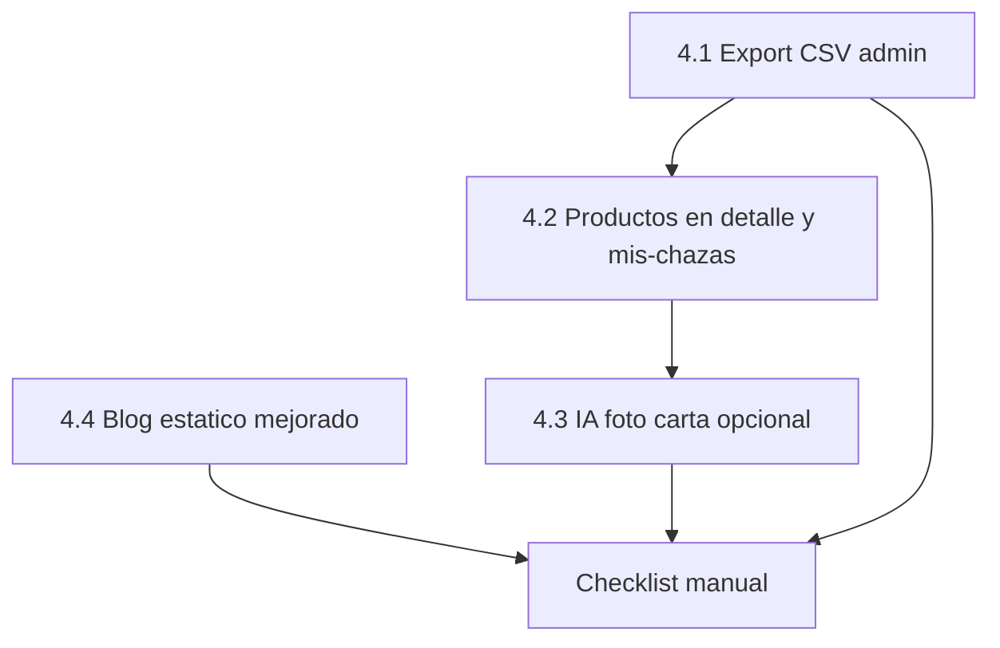

# Plan: Fase 4 — Contenido, metricas exportables e IA opcional

**Prerrequisito:** Fase 3 cerrada en codigo y migracion `20260221120000_reports_moderation.sql` aplicada en Supabase (ya hecho).

**Objetivo de la fase:** dar herramientas de **entrega academica** (export de metricas), mejorar **catalogo de productos** visible y editable, y abrir la puerta a **IA** (foto de carta → productos) sin romper el MVP ni la igualdad del swiper.

**Cuando empezar:** cuando necesites presentar datos agregados, o cuando los chazeros pidan editar carta sin re-publicar. La IA solo si hay presupuesto/API key y politica de privacidad clara para imagenes.

Referencias: [`BUILD_PLAN.md`](BUILD_PLAN.md), [`FASE_3_PLAN.md`](FASE_3_PLAN.md), [`docs/SECURITY.md`](SECURITY.md).

---

## Estado al entrar en Fase 4

| Area | Estado |
|------|--------|
| Auth, chazas, favoritos, resenas, Storage | Supabase operativo |
| Chazero `/mis-chazas` | Edita datos, pin, estado; **no** edita productos aun |
| `chaza_products` en DB | Se crean al publicar; precio "Desde X" en cards |
| Detalle `/chazas/[slug]` | Sin listado de carta/productos |
| Blog | Estatico en `lib/constants/blog-posts.ts` (landing + `/blog`) |
| Admin `/admin/metricas` | Agregados 7d + JSON demo; **sin CSV** desde `analytics_events` |
| Vercel | Opcional; ver [`SUPABASE_SETUP.md`](SUPABASE_SETUP.md) §9 |

---

## Decisiones cerradas (heredadas)

- Explorador: **sin ranking por populares**; pass sigue al final del mazo.
- Blog: **no bloquea** el core; puede seguir decorativo.
- IA: **solo servidor** (API key en env, nunca en cliente); usuario confirma antes de guardar productos sugeridos.
- Sin chat in-app, sin pagos, sin PWA nativa en esta fase.

---

## Orden recomendado de implementacion

1. **4.1** — Export CSV (valor inmediato para entregas).  
2. **4.2** — CRUD productos + carta en detalle (base para IA y chazeros).  
3. **4.3** — Agente foto → productos (opcional, flag env).  
4. **4.4** — Blog con slugs / detalle (IA de articulos solo si hace falta).

**En paralelo (no codigo):** deploy Vercel cuando quieras URL publica (checklist Fase 2 en `SUPABASE_SETUP.md`).

---

## Bloque 4.1 — Export metricas (admin) (~2–3 dias)

**Objetivo:** descargar eventos reales para Excel/Sheets sin copiar JSON a mano.

| Tarea | Detalle |
|-------|---------|
| Server Action | `exportAnalyticsCsvAction({ from?, to? })` en `lib/actions/analytics.ts` — solo `requireAdminSession`, lectura `analytics_events` con limite razonable (ej. 10k filas) |
| Columnas CSV | `created_at`, `session_id`, `name`, `payload` (JSON stringificado) |
| UI | Boton **EXPORTAR CSV** en pestaña Metricas de `admin-metricas-client.tsx` (modo DB); mantener JSON en demo local |
| Seguridad | Sin PII en payload por diseno; documentar en comentario que no exportar a repos publicos |

**Sin migracion SQL.**

**Criterio de hecho:** admin descarga `.csv` con eventos de los ultimos 7 dias que coinciden con los agregados del panel.

---

## Bloque 4.2 — Catalogo de productos (~4–6 dias)

**Objetivo:** la carta deja de ser solo un precio "Desde …" y se gestiona despues de publicar.

| Tarea | Archivos / notas |
|-------|------------------|
| Validacion | `productRowSchema` o ampliar `updateChazaSchema` con `products[]` opcional en `lib/validations/chaza.ts` |
| Actions | `lib/actions/my-chazas.ts`: `getChazaProductsAction`, `replaceChazaProductsAction(slug, products)` — delete+insert o upsert por `chaza_id` respetando RLS |
| Editar chaza | `edit-chaza-form.tsx`: seccion productos (misma UX que wizard: filas + pegar carta) |
| Detalle publico | `chaza-detail-client.tsx`: lista nombre + `price_label` bajo descripcion |
| Mapper | Confirmar `chaza-mapper.ts` sigue usando primer producto para "Desde X" |

**Sin migracion** (tabla `chaza_products` ya existe).

**Fuera de 4.2:** import masivo desde Excel, variantes (tamanos), inventario.

---

## Bloque 4.3 — Agente IA: foto de carta → productos (~1–2 semanas, opcional)

**Objetivo:** acelerar alta de carta para chazeros con muchos items (vision del README).

| Tarea | Detalle |
|-------|---------|
| Env | `GROQ_API_KEY` **solo servidor**; flag `ENABLE_MENU_VISION=true` para no romper dev sin key |
| Ruta / Action | `lib/actions/menu-vision.ts` — recibe imagen (FormData), devuelve `{ name, priceLabel }[]` |
| Prompt | Espanol, campus UN, salida JSON estricta; max N productos (ej. 30) |
| UI | Paso opcional en `publish-chaza-wizard` y boton en editar: "Analizar foto de carta" → preview editable → usuario confirma → `replaceChazaProductsAction` al guardar |
| Seguridad | Tamano max imagen, rate limit por `user.id` via tabla `menu_vision_usage` + RLS (migracion `20260222120000_menu_vision_usage.sql`); no registrar imagen en analytics |
| Costes | Documentar costo aproximado por foto en este doc o README |

**Tabla `menu_vision_usage`** para limite horario sin exponer `analytics_events` a usuarios no admin.

**Alternativa minima:** solo OCR local / pegar texto mejorado — evaluar solo si no hay presupuesto API.

---

## Bloque 4.4 — Blog (~3–5 dias, prioridad baja)

**Objetivo:** mejorar contenido sin CMS completo ni dependencia de IA.

| Opcion | Esfuerzo | Descripcion |
|--------|----------|-------------|
| **A (recomendada)** | Bajo | Rutas `/blog/[slug]`, cuerpo en markdown en `lib/constants/blog-posts.ts` o archivos `content/blog/*.mdx` |
| B | Medio | Tabla `blog_posts` + RLS admin + editor simple |
| C | Alto | Generacion IA de borradores (`generateBlogDraftAction`) + revision humana antes de publicar |

Mantener seccion landing (`blog-section.tsx`) sincronizada con la misma fuente.

**Fuera de Fase 4:** SEO avanzado, comentarios en blog, RSS.

---

## Bloque 4.5 — Vercel y smoke produccion (manual, ~1–2 h)

No es bloque de codigo; desbloquea usuarios reales antes de IA en produccion.

1. Variables en Vercel: `NEXT_PUBLIC_SUPABASE_*` (no service role).  
2. Auth redirect produccion.  
3. `pnpm build` limpio.  
4. Smoke: login, explorar, publicar con foto, `/mis-chazas`, reporte + admin, export CSV.

---

## Fase 5 — Campo y crecimiento (siguiente plan operativo)

No codigo obligatorio hasta decision de producto:

| Item | Nota |
|------|------|
| Kit QR imprimible | Enlace a `/chazas/[slug]`; PDF/HTML plantilla |
| Badge "verificada en ChazasUN" | Diseno + campo opcional `verified_at` en `chazas` (migracion futura) |
| Destacado temporal | **Explicitar** que no altera orden del swiper (solo banner o seccion aparte) |

Cuando quieras, se puede documentar en `docs/FASE_5_PLAN.md` (solo operaciones + migracion minima).

---

## Checklist manual Fase 4 (despues de implementar)

1. Admin: descargar CSV de 7 dias y abrir en hoja de calculo.  
2. Chazero: editar en `/mis-chazas/.../editar` — agregar/quitar productos; ver carta en detalle publico.  
3. (Si 4.3) Subir foto de carta de prueba → revisar sugerencias → guardar → ver en detalle.  
4. Blog: abrir al menos un articulo con URL propia (si implementaste 4.4A).  
5. `pnpm build` sin errores.

---

## Implementado (codigo)

| Bloque | Entrega |
|--------|---------|
| 4.1 | `lib/utils/csv.ts`, `exportAnalyticsCsvAction` en `lib/actions/analytics.ts`, boton **EXPORTAR CSV** en admin (modo DB). |
| 4.2 | `productRowSchema` / `productsListSchema`, `lib/actions/chaza-products.ts`, `getChazaForEditAction` con `products`, `ProductListEditor`, `parseCartaBulk`, carta en `chaza-detail-client`, wizard alineado. |
| 4.3 | `lib/ai/groq-vision.ts`, `analyzeMenuFromImageAction` en `lib/actions/menu-vision.ts`, `MenuVisionPicker`, tabla `menu_vision_usage` + migracion `20260222120000_menu_vision_usage.sql`, env `ENABLE_MENU_VISION`, `GROQ_API_KEY`, `GROQ_VISION_MODEL`. |
| 4.4 | Slugs y `body` en `blog-posts.ts`, ruta `app/(platform)/blog/[slug]/page.tsx`, enlaces desde `/blog` y `blog-section`. |
| 4.5 | Docs: este archivo, `BUILD_PLAN`, `ARCHITECTURE`, `SUPABASE_SETUP`, `SECURITY` (vision Groq). |

### Checklist implementacion (marcar en revision)

- [ ] 4.1 CSV admin 7d + limite 10k filas
- [ ] 4.2 Editar carta + detalle publico + publicar
- [ ] 4.3 Groq: foto → preview → guardar (tras migracion `menu_vision_usage`)
- [ ] 4.4 `/blog/[slug]` desde listado y landing
- [ ] `pnpm exec tsc --noEmit` y `pnpm build` OK

---

## Estimacion total

| Bloque | Tiempo orientativo |
|--------|-------------------|
| 4.1 Export CSV | 2–3 dias |
| 4.2 Productos | 4–6 dias |
| 4.3 IA carta (opcional) | 1–2 semanas |
| 4.4 Blog | 3–5 dias |
| **Total sin IA** | ~1,5–2 semanas |
| **Con IA** | +1–2 semanas |

---

## Fuera de Fase 4

- PWA / app nativa (solo con traccion).  
- Chat, pagos, ranking por populares en swiper.  
- CMS blog completo o marketing automation.  
- Multi-campus (sede distinta a Bogota).
