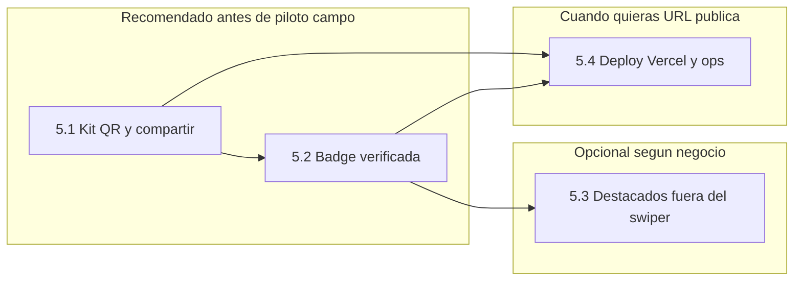

# Plan detallado: Fase 5 — Campo, confianza y crecimiento

**Documento maestro de la siguiente fase de desarrollo** (posterior a Fase 4 en codigo).  
Referencias: [`BUILD_PLAN.md`](BUILD_PLAN.md), [`FASE_4_PLAN.md`](FASE_4_PLAN.md), [`ARCHITECTURE.md`](ARCHITECTURE.md), [`SECURITY.md`](SECURITY.md), [`VERCEL_DEPLOY.md`](VERCEL_DEPLOY.md).

---

## 1. Resumen ejecutivo

| Pregunta | Respuesta corta |
|----------|-------------------|
| ¿Cual es la siguiente fase? | **Fase 5**: herramientas de **campo** (QR, compartir ficha), **confianza** (badge verificada), **destacados fuera del swiper** (opcional), y **operacion** (deploy cuando decidas, metas 30/50 chazas). |
| ¿Puedo seguir sin Vercel? | **Si.** Puedes implementar casi todo en local; el QR puede apuntar a `localhost` solo para pruebas tuyas, o a una URL publica cuando despliegues. |
| ¿Que no entra en Fase 5? | Pagos in-app, chat, ranking por populares **dentro del mazo**, app nativa (antes valora **PWA**). |

---

## 2. Contexto: donde esta el proyecto al iniciar Fase 5

### 2.1 Cerrado en codigo (Fases 0–4)

- Explorador swiper, mapa, detalle `/chazas/[slug]`, publicar, `/mis-chazas`, resenas, reportes, admin (metricas + CSV + moderacion).
- Carta / productos en edicion y detalle; vision de carta opcional (Groq); blog estatico `/blog/[slug]`.
- Auth Supabase: correo/contrasena, recuperacion, **Google OAuth** (si ya lo integraste en el dashboard y en Google Cloud).

### 2.2 Entrada natural a Fase 5

| Necesidad de negocio | Como la cubre Fase 5 |
|----------------------|----------------------|
| Equipo de campo necesita enlace/QR al puesto | Bloque **5.1** |
| Visitantes desconfian sin señal de validacion | Bloque **5.2** |
| Campañas sin romper igualdad en el swiper | Bloque **5.3** (opcional) |
| URL publica y pruebas reales | Bloque **5.4** + [`VERCEL_DEPLOY.md`](VERCEL_DEPLOY.md) (cuando tu elijas) |

### 2.3 Principios de producto (no romper sin decision explicita)

| Regla | Implicacion técnica |
|-------|---------------------|
| Igualdad en el **mazo** del explorador | Ningun “boost” reordena el deck principal por pago o popularidad. |
| Pass va al final del mazo | Sin cambios. |
| Destacado / verificado | Puede afectar **UI** (badge, banner, seccion aparte), no el algoritmo del swipe por defecto. |
| Contacto publico | Sigue siendo opt-in (WhatsApp / redes). |

---

## 3. Vision general por bloques



**Orden sugerido de implementacion en codigo:** **5.1 → 5.2 → (5.3 si aplica) → 5.4** cuando toque deploy.

---

## 4. Bloque 5.1 — Kit QR, compartir enlace y material de campo

### 4.1 Objetivo de negocio

Que un chazero (o el equipo de campo) comparta **una sola URL estable** a su ficha (`/chazas/<slug>`) sin depender de que el visitante encuentre la chaza en el swiper.

### 4.2 Alcance funcional

| Entrega | Descripcion |
|---------|-------------|
| **URL canonica** Ya existe | `https://<dominio>/chazas/<slug>` (en local: `http://localhost:3001/chazas/<slug>`). |
| **Copiar enlace** | Boton en detalle (si es dueno o siempre publico) y/o en fila de `/mis-chazas`. |
| **Texto para redes** | Plantilla corta (WhatsApp/IG) con nombre + enlace (copiar al portapapeles). |
| **QR** | Generacion en cliente (PNG/SVG descargable) apuntando a esa URL. Dependencia tipica: `qrcode` o API equivalente. |
| **Print-friendly (opcional)** | Ruta o componente imprimible (A6/A5) con logo + QR + “Encuentranos en ChazasUN”. |

### 4.3 Tareas tecnicas sugeridas (checklist)

- [x] Componente cliente `ShareChazaButton` o seccion en `chaza-detail-client` / `mis-chazas` (evaluar dueno vs publico).
- [x] Util: `getChazaPublicUrl(slug)` usando `window.location.origin` o `site` config + env `NEXT_PUBLIC_SITE_URL` **opcional** para QR en SSR/build (si sin deploy, origin en cliente basta).
- [x] Añadir dependencia QR si se usa libreria; mantener bundle razonable (dynamic import).
- [ ] Documento corto para campo: `docs/CAMPO_QR.md` o seccion en README (guion 30s, FAQ) — solo si el equipo lo va a usar.

### 4.4 Criterios de hecho (DoD)

1. Desde **tu cuenta** como dueno, generas QR y/o copias enlace y abres la **ficha correcta** en movil.
2. Sin regresiones en detalle ni listado.
3. `pnpm build` OK.

### 4.5 Riesgos y mitigacion

| Riesgo | Mitigacion |
|--------|------------|
| QR con `localhost` inutil para otros | Esperado en dev; en piloto real usar URL Vercel (**5.4**) o tunnel temporal. |
| Duplicar logica de URL | Una sola funcion `getChazaPublicUrl`. |

### 4.6 Esfuerzo orientativo

**2–4 dias** (mas si incluyes diseno fino de PDF/plantilla).

---

## 5. Bloque 5.2 — Badge “verificada en ChazasUN”

### 5.1 Objetivo de negocio

Señal clara de que el equipo **valido** el puesto (presencia razonable en campus, datos coherentes). **No** sustituye moderacion ni implica aval de la universidad.

### 5.2 Modelo de datos (propuesta minima)

- Columna en `public.chazas`: `verified_at timestamptz null`  
  - `null` = no verificada; **no null** = verificada (fecha como auditoria).
- Alternativa extendida (fase posterior): `verified_by uuid` referencia admin.

### 5.3 Backend y seguridad

| Tarea | Detalle |
|-------|---------|
| Migracion SQL | `ALTER TABLE chazas ADD COLUMN verified_at ...`; comentario en tabla. |
| RLS | **Solo administradores** pueden `UPDATE chaza.verified_at` (misma nocion de admin que metricas/reportes: `profiles.is_admin` o policy por rol service en server action exclusiva admin). |
| Server Action | Ej. `setChazaVerifiedAction(slug, verified: boolean)` con `requireAdminSession()`. |
| Revalidacion | `revalidatePath` para `/chazas/[slug]`, `/explorar`, `/mapa`, `/mis-chazas` segun donde se muestre la chaza. |

### 5.4 UI

| Superficie | Comportamiento |
|------------|----------------|
| `/chazas/[slug]` | Badge discreto + `title`/tooltip explicativo. |
| Cards (grid / lista) | Opcional si no satura; mismo tooltip. |
| `/admin/metricas` o subvista | Toggle o botones “Verificar” / “Quitar verificacion” ligados a busqueda por slug o lista de chazas. |
| `/terminos` o `/privacidad` | Parrafo: verificado **no** es aval institucional UN. |

### 5.5 Tipos y mapper

- Extender tipos `Chaza` / `ChazaCard` / filas DB con `verifiedAt?: string | null`.
- `chaza-mapper.ts`: mapear columna a card.

### 5.6 Criterios de hecho

1. Admin puede verificar y quitar verificacion; cambio persiste tras recarga.
2. Visitante anonimo ve badge en detalle cuando aplica.
3. Usuario no admin no puede mutar `verified_at` (probar en red o con cliente anonimo).

### 5.7 Esfuerzo orientativo

**3–6 dias** (depende de cuán pulido sea el panel admin).

---

## 6. Bloque 5.3 — Destacados temporales (opcional)

### 6.1 Objetivo

Campañas o socios con **visibilidad extra** en zonas **no competitivas** con el mazo del swiper.

### 6.2 Superficies permitidas (elegir al menos una)

| Superficie | Ventaja |
|------------|---------|
| Banner bajo navbar o en home | Muy visible; rotacion manual o por fecha. |
| Carrusel “Apoyan / destacadas” | Separado visualmente del feed principal. |
| Pestaña o toggle en `/explorar` | El usuario elige ver “solo destacadas” sin mezclar orden del mazo por defecto. |

### 6.3 Modelo de datos (elegir uno)

**Opcion A — Minima:** columnas en `chazas`

- `featured_until timestamptz null`
- `featured_rank int null` (orden dentro del carrusel)

**Implementado en repo:** migracion `20260520120000_chazas_featured.sql`, acciones `lib/actions/admin-chaza-featured.ts`, franja horizontal en `/explorar` (`ChazaSwiper` + `ChazaGridCard`), panel admin pestaña **DESTACADOS**.

**Opcion B — Campañas:** tabla `chaza_spotlights (id, chaza_id, starts_at, ends_at, placement text)`

### 6.4 Reglas

- Solo **admin** (o script) marca destacado.
- Consultas publicas: solo chazas `status = published` y vigentes por fecha.
- **Prohibido** usar `featured_rank` para ordenar el **deck** del swiper por defecto.

### 6.5 Criterios de hecho

1. Destacadas visibles solo en la superficie acordada.
2. Explorador principal (swiper) **sin** cambio de orden por “destacado”.
3. Expiracion por fecha verificada.

### 6.6 Esfuerzo orientativo

**3–7 dias** (según diseño y si hay panel admin para gestionar fechas).

---

## 7. Bloque 5.4 — Operaciones, deploy y medicion (cuando decidas)

### 7.1 Deploy en Vercel

- **No bloquea** 5.1–5.3 en codigo; **si bloquea** un piloto real con QR en puestos externos a tu red.
- Guia paso a paso: [`VERCEL_DEPLOY.md`](VERCEL_DEPLOY.md) (variables, Site URL, Redirect URLs, Google en produccion).

### 7.2 Tras el deploy

| Verificacion | Notas |
|--------------|-------|
| Smoke Auth | Login email + Google; recuperar contrasena. |
| Smoke datos | Explorar, detalle, publicar, Storage portada. |
| Smoke admin | Metricas, CSV, reportes. |
| Google Cloud | Origen JS incluye `https://tu-app.vercel.app`. |

### 7.3 Metas de campo (negocio)

- **30 chazas** mes 1 / **50** mes 2 (segun [`BUILD_PLAN.md`](BUILD_PLAN.md)): seguimiento en hoja/Notion; fuera del repo salvo docs ligeros.

### 7.4 Esfuerzo orientativo

**1–2 dias** tecnicos de deploy + ajustes; operacion continua con el equipo.

---

## 8. Plan de ejecucion sugerido (semanas)

Escenario **sin desplegar todavia** (tu caso actual):

| Semana | Enfoque |
|--------|---------|
| **1** | 5.1 completo (compartir + QR + pruebas en local). |
| **2** | 5.2: migracion + action admin + UI badge + copy legal. |
| **3** | 5.3 solo si hay decision de negocio; si no, pulir 5.1/5.2 y recomendados menores. |
| **Cuando elijas** | 5.4 Vercel + smoke + QR apuntando a dominio real. |

Escenario **piloto campus pronto**: acorta 5.1 y anticipa 5.4 para tener URL estable antes de imprimir QRs.

---

## 9. Registro de riesgos

| ID | Riesgo | Impacto | Mitigacion |
|----|--------|---------|------------|
| R1 | Destacados mal disenados confundidos con “orden del swiper” | Alto (producto) | Copy claro; ubicacion UI separada; tests manuales. |
| R2 | `verified_at` sin RLS estricta | Seguridad | Policies solo admin; revisar con cuenta anonima. |
| R3 | QR en prod sin HTTPS | Confianza | Vercel + dominio `https`. |
| R4 | Google OAuth solo en local | Piloto | Completar orígenes y Supabase URLs al desplegar. |

---

## 10. Definicion de “Fase 5 cerrada” (codigo + operacion minima)

Criterios **codigo** (ajusta si omites 5.3):

- [x] 5.1: compartir + QR (`ChazaShareButton`, `lib/utils/chaza-public-url.ts`).
- [x] 5.2: verificacion admin + badge + copy legal.
- [x] 5.3: destacados fuera del swiper (franja `/explorar`), sin reordenar el deck.
- [x] `pnpm exec tsc --noEmit` y `pnpm build` sin errores (validar en CI/local).

Criterios **operacion** (cuando quieras producto publico):

- [ ] Deploy segun [`VERCEL_DEPLOY.md`](VERCEL_DEPLOY.md).
- [ ] 3+ chazas piloto con QR probado en movil.
- [ ] Encuesta o canal de feedback definido con equipo.

---

## 11. Detras de Fase 6 (solo orientacion, sin plan cerrado)

Posibles lineas **no comprometidas** hasta cerrar Fase 5:

- **PWA** (manifest, iconos, “instalar”).
- **Multi-campus** (`campus_id` ya pensado en README).
- **Mejoras SEO** blog y detalle chaza.
- **CMS blog** o IA de articulos (explicitamente fuera del MVP historico).

---

## 12. Checklist rapido (imprimible)

```
[x] 5.1  Compartir URL + QR (detalle y mis chazas; en local el QR apunta a localhost)
[x] 5.2  Migracion verified_at + admin + badge + terminos
[x] 5.3  Destacados: migracion featured + franja /explorar + admin DESTACADOS
[ ] 5.4  Vercel + Supabase URLs + smoke
[x] Build y tsc OK (revisar al cierre de cada release)
```

---

## 13. Estimacion global Fase 5

| Bloque | Dias (orden de magnitud) |
|--------|---------------------------|
| 5.1 | 2–4 |
| 5.2 | 3–6 |
| 5.3 | 3–7 (opcional) |
| 5.4 | 1–2 + ops |

**Total sin 5.3 ni deploy:** ~1–2 semanas a tiempo parcial.  
**Con 5.3 y deploy:** ~2–4 semanas segun diseno y equipo.

---

*Ultima actualizacion alineada con Fases 0–4 cerradas en codigo; Auth Google puede estar ya configurado en local. El deploy permanece opcional hasta que necesites URL publica.*
