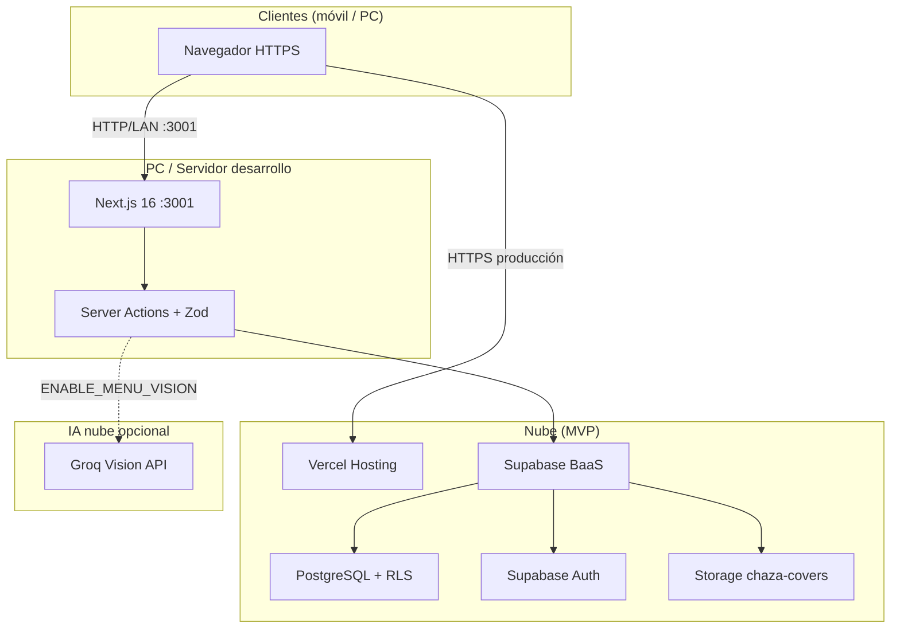
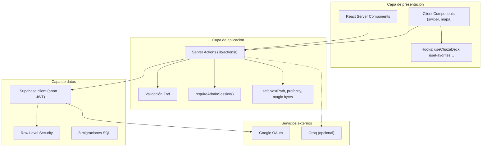
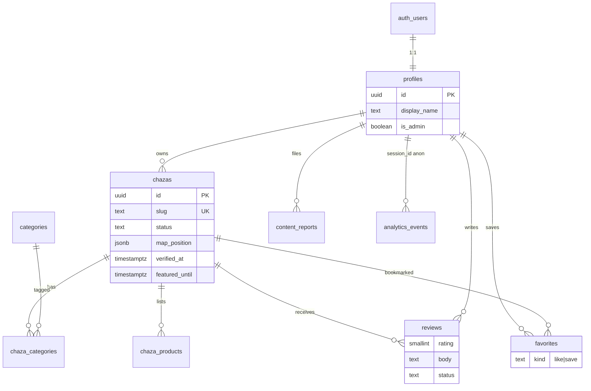
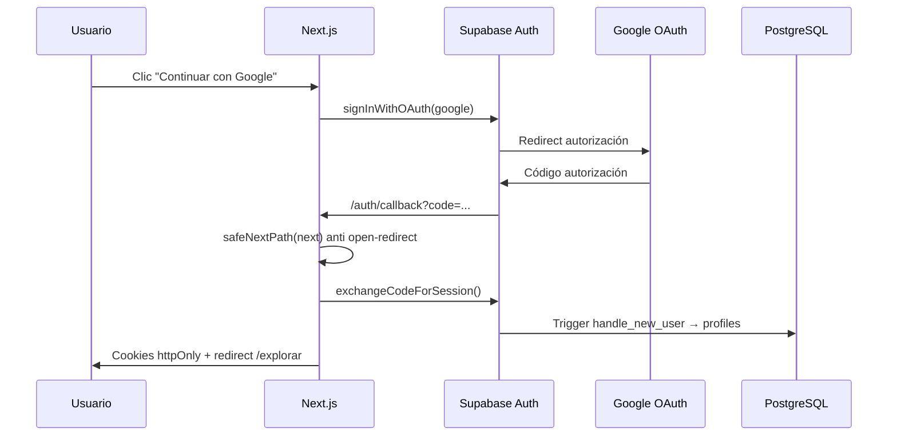
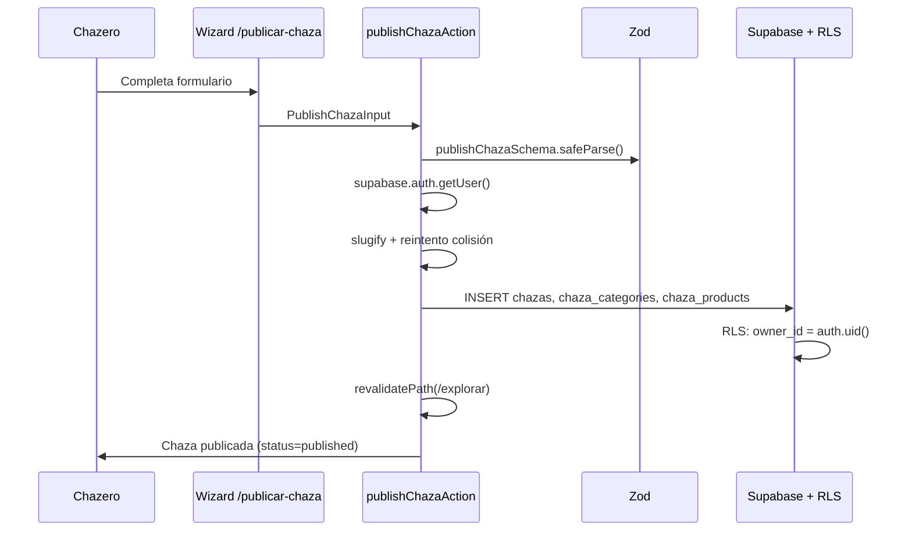
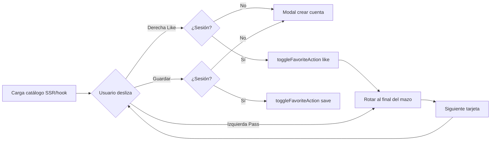
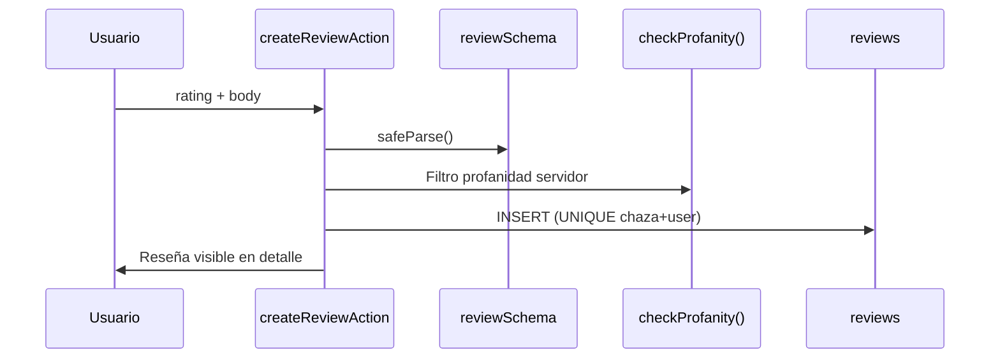

# ChazasUN — Informe Académico Técnico

**Proyecto:** Marketplace universitario para descubrimiento de chazas en el campus de la Universidad Nacional de Colombia (sede Bogotá)  
**Versión del software:** 0.1.0 (`package.json`)  
**Fecha del informe:** junio 2026  
**Repositorio:** [https://github.com/sebastianvelace/ChazasUN-1.1](https://github.com/sebastianvelace/ChazasUN-1.1)

**Documentos de referencia interna:** [`README.md`](../README.md) · [`GUIA_COMPLETA.md`](GUIA_COMPLETA.md) · [`ARCHITECTURE.md`](ARCHITECTURE.md) · [`SECURITY.md`](SECURITY.md) · [`BUILD_PLAN.md`](BUILD_PLAN.md)

---

## 1. Abstract

ChazasUN is a free, mobile-first web platform that centralizes discovery of informal campus stalls (“chazas”) at Universidad Nacional de Colombia, Bogotá, replacing word-of-mouth with a Tinder-like swiper, interactive campus map, and authenticated reviews. The proposed architecture combines Next.js 16, React 19, Supabase (PostgreSQL with Row Level Security), and Vercel hosting at zero marginal cost for the MVP. Content moderation relies on server-side profanity filtering and admin-only tools; no edge hardware is required. The current prototype achieves full visitor-to-vendor flows in local development: publishing, favorites, analytics, admin moderation, and optional Groq menu vision; production deployment remains in progress.

---

## 2. Introducción

### 2.1 Contexto del problema

En la sede Bogotá de la Universidad Nacional de Colombia coexisten decenas de **chazas**: puestos informales de comida, papelería, servicios, libros y otros productos que constituyen un ecosistema económico y social relevante para estudiantes, docentes, empleados y visitantes. La información sobre qué vende cada puesto, dónde se ubica, a qué precio y cómo contactar al emprendedor circula principalmente por **boca a boca**, grupos de WhatsApp, señalización física dispersa o redes sociales personales del chazero.

Este modelo de difusión presenta limitaciones estructurales:

- **Fragmentación:** no existe un catálogo único, actualizado y accesible desde el móvil.
- **Asimetría de información:** chazas nuevas o con baja visibilidad social quedan fuera del radar de potenciales clientes.
- **Dependencia de redes informales:** quien no pertenece a los grupos correctos o no conoce el campus pierde oportunidades de descubrimiento.
- **Ausencia de señales de confianza centralizadas:** reseñas y reputación no se agregan en un solo lugar verificable.

ChazasUN surge como iniciativa **estudiantil independiente** (no oficial de la universidad) para atender esta brecha informativa en el campus, con alcance geográfico inicial restringido a Bogotá y arquitectura preparada para futuras sedes mediante identificadores de campus en base de datos.

### 2.2 Necesidad identificada

Del análisis de producto y entrevistas con el equipo fundador se identificaron las siguientes necesidades:

| Actor | Necesidad |
|-------|-----------|
| **Visitante del campus** | Descubrir chazas de forma rápida, divertida y desde el móvil; guardar favoritos; consultar ubicación en mapa; leer reseñas antes de acercarse |
| **Chazero (emprendedor)** | Publicar su puesto sin fricción administrativa; editar catálogo y precios; compartir enlace o QR; obtener visibilidad equitativa |
| **Equipo operativo** | Métricas de uso para presentaciones académicas; moderación de contenido tóxico; verificación manual de chazas reales |
| **Requisitos transversales** | Costo operativo $0 en MVP; stack open source; navegación sin datos personales; HTTPS en producción; idioma español exclusivo; sin pagos ni chat in-app |

La **moderación de contenido** se implementa mediante filtro léxico en servidor (`lib/security/profanity.ts`) y herramientas exclusivas de administrador (cola de reportes, verificación de chazas).

### 2.3 Solución propuesta

**ChazasUN** es una plataforma web responsive que funciona como marketplace de descubrimiento:

1. **Explorador tipo Tinder (swiper):** una tarjeta por chaza; deslizar derecha (like) o izquierda (pass); el pass no oculta permanentemente — la chaza rota al final del mazo (modelo flashcards).
2. **Mapa interactivo del campus:** plano PNG con pins posicionables por el chazero; enlaces a Google Maps para navegación externa.
3. **Ficha detallada** (`/chazas/[slug]`): productos, precios, horarios, contacto opt-in (WhatsApp/Instagram), reseñas y reportes.
4. **Publicación automática:** wizard `/publicar-chaza` sin cola de aprobación manual; validación Zod + RLS en servidor.
5. **Panel administrativo:** métricas, export CSV, cola de reportes, badge verificada, destacados temporales.

El modelo de negocio es **100 % gratuito** en el MVP. La monetización futura contemplada (solo con tracción demostrada) es publicidad destacada, sin afectar la igualdad de visibilidad en el mazo principal del swiper.

---

## 3. Diseño del sistema

### 3.1 Requerimientos

#### 3.1.1 Requerimientos funcionales

| ID | Requerimiento | Estado |
|----|---------------|--------|
| RF-01 | Explorar chazas en swiper sin cuenta | ✅ Implementado |
| RF-02 | Like y guardar con cuenta autenticada | ✅ Implementado |
| RF-03 | Publicar y editar chaza con catálogo de productos | ✅ Implementado |
| RF-04 | Mapa con pins y filtro por categoría | ✅ Implementado |
| RF-05 | Reseñas con cuenta + filtro de profanidad | ✅ Implementado |
| RF-06 | Reportes de contenido y moderación admin | ✅ Implementado |
| RF-07 | Analytics sin PII para navegación | ✅ Implementado |
| RF-08 | Compartir enlace y QR por chaza | ✅ Implementado |
| RF-09 | Moderación de reseñas (profanidad + admin) | ✅ Implementado |
| RF-10 | Visión de carta con Groq (opcional) | ✅ Opcional |

#### 3.1.2 Requerimientos no funcionales

| ID | Requerimiento | Criterio de aceptación |
|----|---------------|------------------------|
| RNF-01 | **Costo MVP $0** | Supabase free tier + Vercel hobby; sin servicios de pago obligatorios |
| RNF-02 | **Stack open source** | Next.js, React, PostgreSQL, Tailwind, Zod — licencias permisivas |
| RNF-03 | **Sin PII en analytics de navegación** | UUID anónimo en `sessionStorage`; eventos en `analytics_events` sin email |
| RNF-04 | **HTTPS** | TLS automático en Vercel; cookies `httpOnly` vía `@supabase/ssr` |
| RNF-05 | **RLS** | Políticas en todas las tablas con datos de usuario |
| RNF-06 | **Mobile-first** | Swiper con gestos táctiles; UI responsive con Tailwind 4 |
| RNF-07 | **Idioma español** | Interfaz y contenido v1 solo en español |
| RNF-08 | **Sin pagos** | No hay pasarela, comisiones ni procesamiento de tarjetas |
| RNF-09 | **Moderación de contenido** | Filtro profanidad en servidor + moderación admin |

#### 3.1.3 Restricciones de diseño

- Proyecto **no oficial** de la UN; sin implicar aval institucional.
- Sin chat in-app: contacto externo (WhatsApp, Instagram, presencial).
- Sin verificación de carnet universitario.

### 3.2 Entorno de despliegue

El producto es **exclusivamente software**. No requiere hardware especializado más allá de un entorno estándar de desarrollo y despliegue en nube.

#### 3.2.1 Componentes del sistema

| Componente | Función | Estado |
|------------|---------|--------|
| PC / laptop desarrollo | Servidor Next.js (`pnpm dev`, puerto 3001), cliente Supabase, IDE | ✅ En uso |
| Red LAN Wi-Fi/Ethernet | Acceso desde móviles en campus/laboratorio (bonus servidor LAN) | ✅ Posible |
| Vercel (producción) | Hosting HTTPS, TLS automático | ⏳ Pendiente deploy |
| Supabase Cloud | PostgreSQL, Auth, Storage | ✅ En uso |

#### 3.2.2 Diagrama de bloques (sistema completo)



#### 3.2.3 Diagrama ASCII (despliegue local actual)

```
┌─────────────────┐     HTTP/LAN      ┌──────────────────────┐
│  Clientes       │ ◄──────────────► │  PC / Servidor dev    │
│  (móvil, PC)    │   :3001          │  Next.js + Supabase   │
└─────────────────┘                   └──────────┬───────────┘
                                                 │ HTTPS (producción)
                                                 ▼
                                      ┌──────────────────────┐
                                      │  Vercel + Supabase     │
                                      │  (hosting + BaaS)      │
                                      └──────────────────────┘
```

### 3.3 Software

#### 3.3.1 Stack tecnológico (versiones verificadas en `package.json`)

| Capa | Tecnología | Versión |
|------|------------|---------|
| Framework | Next.js (App Router) | **16.2.6** |
| UI | React / React DOM | **19.2.4** |
| Estilos | Tailwind CSS | **4.2.0** |
| Componentes | shadcn/ui (Radix UI) | múltiples @radix-ui/* |
| Backend | Supabase JS + SSR | **@supabase/supabase-js 2.105.4**, **@supabase/ssr 0.10.3** |
| Validación | Zod + react-hook-form | **zod 3.24.1**, **react-hook-form 7.54.1** |
| Hosting | Vercel + Analytics | **@vercel/analytics 1.6.1** |
| Lenguaje | TypeScript | **5.7.3** |
| IA carta (opcional) | Groq Vision | servidor, `GROQ_API_KEY` |
| QR | qrcode | **1.5.4** |

#### 3.3.2 Arquitectura por capas



**Principios arquitectónicos** (ver [`ARCHITECTURE.md`](ARCHITECTURE.md)):

- App Router con route groups: `(marketing)`, `(platform)`, `(auth)`.
- Sin lógica SQL en componentes UI; mutaciones exclusivamente vía Server Actions.
- Colocation por dominio: `components/chazas`, `components/map`, `lib/validations`.
- Analytics con sesión anónima; sin email en eventos de producto.

#### 3.3.3 Modelo de datos (resumen)



**Tablas principales:**

| Tabla | Propósito |
|-------|-----------|
| `profiles` | Perfil 1:1 con `auth.users`; `display_name`, `is_admin` |
| `categories` | 13 categorías alineadas a `config/categories.ts` |
| `chazas` | Puesto: slug, ubicación, contacto, estado, verificación, destacados |
| `chaza_categories` | Relación N:M chaza–categoría |
| `chaza_products` | Catálogo: nombre, `price_label`, orden |
| `favorites` | Like (`kind=like`) y guardado (`kind=save`); PK compuesta |
| `reviews` | Rating 1–5, cuerpo, `status`; UNIQUE `(chaza_id, user_id)` |
| `analytics_events` | Eventos anónimos: `session_id`, `name`, `payload` |
| `content_reports` | Denuncias de chaza o reseña; cola admin |
| `menu_vision_usage` | Límite horario uso Groq por usuario |

**Storage:** bucket `chaza-covers` (público lectura; escritura en carpeta `{user_id}/`, máx. 5 MB, MIME imagen).

#### 3.3.4 Diagramas de flujo

##### Autenticación (email + Google OAuth)



##### Publicar chaza



##### Swiper (explorador)



**Regla de negocio crítica:** el pass **nunca elimina** la chaza del mazo; solo la mueve al final (`hooks/use-chaza-deck.ts`).

##### Reseñas



#### 3.3.5 Seguridad en diseño

| Mecanismo | Implementación |
|-----------|----------------|
| **RLS** | Todas las tablas de usuario; lectura pública solo de chazas `published` |
| **Server Actions** | Toda mutación; `getUser()` antes de INSERT/UPDATE |
| **Zod** | Espejo cliente/servidor en `lib/validations/` |
| **Open redirect** | `lib/security/safe-redirect.ts` en `/auth/callback` |
| **Uploads** | Magic bytes + MIME allowlist en `uploadChazaCoverAction` |
| **CSP** | `next.config.mjs` en producción |
| **CHECK URL** | Migración `20260521120000_chaza_cover_url_check.sql` |

---

## 4. Desarrollo

El alcance detallado de este informe cubre las **Fases 0–2** (estructura frontend, núcleo Supabase, producción local con métricas y mapa), más **endurecimiento de seguridad** y **iteraciones de UI** posteriores. Las Fases 3–5.3 se mencionan como extensión del MVP cerrado en código.

### 4.1 Fase 0 — Estructura y frontend

**Objetivo:** validar UX del producto sin dependencia de backend.

| Entregable | Descripción técnica |
|------------|---------------------|
| App Router | Route groups `(marketing)`, `(platform)`, `(auth)` |
| Swiper flashcards | `components/chazas/chaza-swiper.tsx`, `hooks/use-chaza-deck.ts` |
| Landing | Hero, categorías, cómo funciona, CTAs a rutas reales |
| Mapa base | `public/maps/campus-bogota.png`, `CampusMap` |
| Analytics anónimo | `sessionStorage` + buffer de eventos |
| Legales | `/terminos`, `/privacidad` |
| Auth prompt | Like/guardar sin cuenta → modal registro |

**Resultado:** prototipo navegable en `http://localhost:3001` con mocks en `lib/constants/` y fallback `localStorage` cuando no hay Supabase configurado.

### 4.2 Fase 1 — Supabase core

**Objetivo:** persistencia real, autenticación y flujos CRUD.

| Entregable | Archivos / tablas clave |
|------------|-------------------------|
| Esquema SQL + RLS | `20260218120000_init_schema.sql` |
| Auth email + Google | `(auth)/login`, `(auth)/registro`, `app/auth/callback/route.ts` |
| Publicar chaza | `lib/actions/publish-chaza.ts`, `/publicar-chaza` |
| Favoritos | `favorites`, `lib/actions/favorites.ts`, `useFavorites` |
| Reseñas | `reviews`, `lib/actions/reviews.ts`, `lib/security/profanity.ts` |
| Storage portadas | `20260220120000_storage_admin_analytics.sql`, bucket `chaza-covers` |
| Seed demo | `pnpm db:seed` → 14 chazas (`scripts/seed-demo-chazas.ts`) |
| Panel admin base | `/admin/metricas`, `profiles.is_admin` |

**Migración de estado local → remoto:** claves `localStorage` (`chazasun_liked_ids`, `chazasun_saved_ids`, etc.) documentadas en [`BUILD_PLAN.md`](BUILD_PLAN.md) como fallback; con env Supabase activo, la fuente de verdad es PostgreSQL.

### 4.3 Fase 2 — Producción local, mapa y métricas

**Objetivo:** analytics persistidos, mapa con datos reales, admin con agregados DB.

| Entregable | Descripción |
|------------|-------------|
| `analytics_events` | `trackAnalyticsEventAction`; eventos: `page_view`, `swiper_like`, `swiper_pass`, `swiper_card_time` |
| Mapa desde DB | Pins `map_position` / `geo`; filtro categoría por URL |
| Recomendados | `lib/data/recommendations.ts`: likes + proximidad euclidiana en plano |
| Admin métricas | `getAdminMetricsAction`, agregados Supabase |
| Upload portadas | `uploadChazaCoverAction` integrado en wizard |

### 4.4 Endurecimiento de seguridad (mayo 2026)

Iteración transversal posterior a Fase 2, documentada en [`SECURITY.md`](SECURITY.md):

| Riesgo | Mitigación | Artefacto |
|--------|------------|-----------|
| Open redirect OAuth | Solo rutas relativas `/...` | `lib/security/safe-redirect.ts` |
| Upload no-imagen | MIME + magic bytes | `lib/security/image-magic-bytes.ts` |
| Contacto malformado | Regex Zod WhatsApp/Instagram | `lib/validations/chaza.ts` |
| URL portada arbitraria | CHECK `https://` o null | Migración `20260521120000` |
| XSS / recursos externos | Content-Security-Policy | `next.config.mjs` |

### 4.5 Iteraciones de UI y correcciones

| Iteración | Problema | Solución |
|-----------|----------|----------|
| Hidratación swiper | Mismatch servidor/cliente en `ChazaSwiper` | Estado inicial unificado en `useChazaCatalog` + prop `items` SSR |
| Categorías landing | Texto ilegible sobre fondo blanco | Ajuste `text-brand-red` y contraste |
| Hero tipografía | Jerarquía visual débil en mobile | Refinamiento DM Sans + Barlow Condensed |
| Puerto 3001 ocupado | Múltiples instancias `next dev` | Documentación: una instancia; liberar PID |
| CTA registro roto | Ancla `#registro` inexistente en landing | Rutas `/publicar-chaza` y `/registro` |
| Middleware Next 16 | Aviso deprecación `middleware` → `proxy` | Deuda menor registrada |

### 4.6 Extensiones posteriores (contexto, fuera del alcance detallado)

| Fase | Entregas |
|------|----------|
| 3 | `content_reports`, moderación admin, `/mis-chazas` + edición |
| 4 | Export CSV, CRUD productos, blog estático, Groq vision opcional |
| 5.1–5.3 | QR/compartir, `verified_at`, `featured_until` / franja destacados |
| 5.4 | Deploy Vercel + smoke producción — **pendiente** |

### 4.7 Problemas y soluciones (tabla consolidada)

| # | Problema | Causa raíz | Solución aplicada | Evidencia |
|---|----------|------------|-------------------|-----------|
| P1 | Hydration mismatch en swiper | Catálogo cliente ≠ SSR inicial | Unificar fuente en hook + props SSR | `use-chaza-catalog.ts` |
| P2 | Open redirect en callback | Parámetro `next` sin validar | `safeNextPath()` whitelist rutas internas | `app/auth/callback/route.ts` |
| P3 | Subida de archivos maliciosos | Confianza en `Content-Type` cliente | Magic bytes + allowlist MIME | `upload-cover.ts` |
| P4 | Spam reseñas | Múltiples comentarios por usuario/chaza | UNIQUE `(chaza_id, user_id)` + profanidad | migración init + `reviews.ts` |
| P5 | QR apunta a localhost en prod | Falta `NEXT_PUBLIC_SITE_URL` | Variable env documentada para SSR | `.env.example`, README |
| P6 | Reseñas tóxicas | Solo lista léxica | Filtro profanidad + reportes admin | `profanity.ts`, `content_reports` |

---

## 5. Prototipo final

### 5.1 Descripción del prototipo software

El prototipo final software es una aplicación web full-stack ejecutable en **localhost:3001** con Supabase configurado, que cubre el ciclo completo visitante ↔ chazero ↔ administrador. No requiere instalación nativa; basta navegador moderno con JavaScript habilitado.

**Comandos de ejecución:**

```bash
pnpm install
cp .env.example .env.local   # Rellenar claves Supabase
pnpm db:seed                 # Opcional: 14 chazas demo
pnpm dev                     # http://localhost:3001
```

### 5.2 Capturas de pantalla (placeholders)

> Insertar capturas en alta resolución (móvil 390×844 y desktop 1440×900).

| # | Descripción | Ruta | Placeholder |
|---|-------------|------|-------------|
| C1 | Landing + swiper embebido | `/` | [INSERTAR CAPTURA: landing-home-swiper.png] |
| C2 | Explorador completo con búsqueda | `/explorar` | [INSERTAR CAPTURA: explorar-swiper-desktop.png] |
| C3 | Mapa campus con pins | `/mapa` | [INSERTAR CAPTURA: mapa-pins-mobile.png] |
| C4 | Detalle chaza con productos y reseñas | `/chazas/[slug]` | [INSERTAR CAPTURA: detalle-chaza-productos.png] |
| C5 | Wizard publicar chaza | `/publicar-chaza` | [INSERTAR CAPTURA: publicar-wizard-paso3.png] |
| C6 | Mis chazas + QR compartir | `/mis-chazas` | [INSERTAR CAPTURA: mis-chazas-qr-dialog.png] |
| C7 | Panel admin métricas | `/admin/metricas` | [INSERTAR CAPTURA: admin-metricas-csv.png] |
| C8 | Recomendados y guardadas | `/recomendados`, `/guardadas` | [INSERTAR CAPTURA: recomendados-guardadas.png] |

### 5.3 Moderación de contenido

La moderación implementada combina:

- Filtro léxico en servidor al crear reseñas (`lib/security/profanity.ts`)
- Cola de reportes accesible solo a administradores
- Herramientas admin: verificación de chazas, destacados, export CSV

### 5.4 3D / CAD / PCB

No aplica — proyecto software sin componente hardware ni fabricación física.

### 5.5 Simulaciones

| Tipo | Estado |
|------|--------|
| Simulación tráfico / carga web | **N/A** — pruebas manuales en MVP |

---

## 6. Pruebas y resultados

### 6.1 Estrategia de pruebas

El MVP no incluye suite automatizada E2E. La estrategia se basa en:

1. **Checklist manual Fase 1** ([`BUILD_PLAN.md`](BUILD_PLAN.md)).
2. **Pruebas de regresión** tras endurecimiento de seguridad.
3. **Evidencia video** para bonus curso (acceso LAN).

### 6.2 Checklist manual (BUILD_PLAN — Fase 1 datos)

| Paso | Acción | Criterio de éxito |
|------|--------|-------------------|
| 1 | `pnpm dev` en puerto 3001 | Servidor arranca sin error |
| 2 | `pnpm db:seed` con service role | 14 chazas en tabla `chazas` |
| 3 | Registro/login | Sesión persiste tras recarga |
| 4 | `/explorar` | Lista desde DB; like/guardar persisten |
| 5 | Publicar chaza | Visible en explorar y `/chazas/[slug]` |
| 6 | Reseña en detalle | Una por usuario/chaza; profanidad rechazada |
| 7 | Supabase dashboard | Filas en `chazas`, `favorites`, `reviews`, `profiles` |

### 6.3 Tabla de casos de prueba

| ID | Módulo | Caso | Entrada | Resultado esperado | Resultado obtenido | Pass/Fail |
|----|--------|------|---------|-------------------|-------------------|-----------|
| T01 | Auth | Registro email | email válido + contraseña | Perfil en `profiles` | _Completar en ejecución_ | [ ] |
| T02 | Auth | Google OAuth | Cuenta Google | Redirect seguro a `/explorar` | _Completar_ | [ ] |
| T03 | Auth | Open redirect | `next=//evil.com` | Rechazado; fallback `/explorar` | _Completar_ | [ ] |
| T04 | Swiper | Pass sin cuenta | Deslizar izquierda | Chaza al final del mazo | _Completar_ | [ ] |
| T05 | Swiper | Like sin cuenta | Deslizar derecha | Modal auth | _Completar_ | [ ] |
| T06 | Swiper | Like con cuenta | Deslizar derecha | Fila en `favorites` kind=like | _Completar_ | [ ] |
| T07 | Publicar | Wizard completo | Datos Zod válidos | `status=published` | _Completar_ | [ ] |
| T08 | Publicar | Slug duplicado | Nombre colisiona | Sufijo automático | _Completar_ | [ ] |
| T09 | Reseñas | Texto limpio | "Excelente café" | `status=published` | _Completar_ | [ ] |
| T10 | Reseñas | Profanidad | Texto ofensivo | Error servidor | _Completar_ | [ ] |
| T11 | Reseñas | Duplicado | Segunda reseña misma chaza | Error UNIQUE | _Completar_ | [ ] |
| T12 | Mapa | Filtro categoría | `?categoria=cafe` | Solo chazas categoría | _Completar_ | [ ] |
| T13 | Upload | Archivo .exe renombrado | Magic bytes inválidos | Rechazo upload | _Completar_ | [ ] |
| T14 | Admin | CSV export | Usuario admin | Descarga `analytics_events` | _Completar_ | [ ] |
| T15 | QR | Compartir chaza | Botón en detalle | PNG QR + enlace | _Completar_ | [ ] |
| T16 | LAN | Acceso móvil | `http://192.168.x.x:3001` | App carga en Wi-Fi | _Pendiente video_ | [ ] |

### 6.4 Métricas objetivo (entregas académicas)

Desde `analytics_events` y panel admin:

| Métrica | Fuente | Uso |
|---------|--------|-----|
| Sesiones únicas / día | `session_id` distinto | Presentaciones |
| Tiempo medio por tarjeta | `swiper_card_time` | UX swiper |
| Ratio like/pass | `swiper_like` vs `swiper_pass` | Engagement |
| Chazas publicadas | COUNT `chazas` | Metas 30/50 |

### 6.5 Videos de evidencia (placeholders)

| Video | Contenido | Placeholder |
|-------|-----------|-------------|
| Demo flujo completo | Explorar → like → reseña → admin | [INSERTAR ENLACE VIDEO: demo-flujo-completo.mp4] |
| Bonus LAN | Móvil en Wi-Fi abre IP del PC | [INSERTAR ENLACE VIDEO: bonus-servidor-lan.mp4] |

---

## 7. Viabilidad del producto y mercado

### 7.1 Público objetivo

| Segmento | Descripción | Necesidad principal |
|----------|-------------|---------------------|
| Estudiantes UN Bogotá | ~40 000+ en campus | Descubrir comida/servicios entre clases |
| Docentes y empleados | Personal universitario | Opciones de almuerzo y servicios |
| Visitantes | Familiares, aspirantes, eventos | Orientación en campus extenso |
| Chazeros | Emprendedores informales | Visibilidad sin costo de marketing |

La plataforma es **abierta**: no exige carnet ni verificación institucional, ampliando el mercado potencial a cualquier persona que transite el campus.

### 7.2 Problema de mercado que resuelve

ChazasUN ataca la **asimetría de información** en un mercado geográficamente concentrado (campus) pero informacionalmente fragmentado. Sustituye:

- Grupos de WhatsApp cerrados → catálogo público indexable.
- Boca a boca lento → descubrimiento gamificado (swiper).
- Señalización física estática → mapa actualizable con pins editables.

### 7.3 Análisis de competencia

| Alternativa | Fortaleza | Debilidad vs ChazasUN |
|-------------|-----------|------------------------|
| Boca a boca | Alta confianza interpersonal | No escala; excluye recién llegados |
| Grupos WhatsApp/Telegram | Actualización rápida | Fragmentado; sin mapa ni catálogo estructurado |
| Instagram del chazero | Visual atractivo | Sin agregación campus; sin reseñas cruzadas |
| Google Maps genérico | Ubicación GPS | No cataloga productos/precios de puestos informales |
| Apps delivery (Rappi, etc.) | Logística | Comisiones; chazas informales fuera de alcance |

**Diferenciador ChazasUN:** combinación de swiper + mapa campus específico + reseñas moderadas + enfoque exclusivo en chazas UN + costo $0 para chazeros.

### 7.4 Modelo de ingresos y precio

| Concepto | Valor |
|----------|-------|
| Precio usuario final | **$0** |
| Precio chazero | **$0** en MVP |
| Monetización futura | Publicidad destacada (franja `/explorar`, sin alterar mazo principal) |
| Transacciones | Fuera de plataforma (presencial, WhatsApp); ChazasUN no es intermediario de pago |

### 7.5 Costos estimados de operación

| Ítem | Costo mensual MVP | Notas |
|------|-------------------|-------|
| Supabase | $0 | Free tier: 500 MB DB, 1 GB Storage |
| Vercel | $0 | Hobby; dominio `*.vercel.app` incluido |
| Dominio custom | ~$1/mes (~$12/año) | Opcional |
| Groq vision | $0–variable | Opcional; free tier limitado |
| **Total operación web** | **≈ $0/mes** | Escalable a planes pagos si crece tráfico |

### 7.6 Costos de desarrollo y hardware (BOM académico)

| Ítem | Costo estimado (USD) | Amortización |
|------|---------------------|--------------|
| PC/laptop desarrollo | Preexistente | — |
| **BOM incremental proyecto** | **$0** marginal | Solo software; hosting en free tier |

### 7.7 Metas de adopción

| Periodo | Meta | Estrategia |
|---------|------|------------|
| Mes 1 | 30 chazas registradas | Equipo de campo + QR en puestos |
| Mes 2 | 50 chazas acumuladas | Incentivos por definir con chazeros |
| Tracción | Usuarios recurrentes | Web mobile; evaluar PWA antes de app nativa |

### 7.8 Viabilidad técnica y escalabilidad

- **PostgreSQL** escala a miles de chazas sin cambio arquitectónico.
- **RLS** garantiza multi-tenant seguro sin backend custom.
- **Vercel + Supabase** eliminan DevOps de servidores para el MVP.
- **Riesgo:** dependencia de conectividad; offline/PWA es trabajo futuro.
- **Riesgo:** calidad de datos (chazas falsas) mitigada con verificación admin y reportes.

### 7.9 Viabilidad legal y de marca

- Proyecto **independiente**; sin aval UN.
- Páginas `/terminos` y `/privacidad` implementadas.
- Contacto WhatsApp con aviso de visibilidad pública.
- Para producción masiva: revisión Ley 1581 de 2012 (Habeas Data Colombia) recomendada.

---

## 8. Conclusiones

### 8.1 Logros alcanzados

El proyecto **ChazasUN cumple el objetivo de MVP web** definido para las fases 0–5.3: una plataforma funcional en entorno local que conecta visitantes con chazas del campus UN Bogotá mediante un explorador swiper mobile-first, mapa interactivo, fichas con catálogo de productos, sistema de reseñas con moderación léxica, favoritos, recomendaciones por proximidad, panel administrativo con export CSV, y herramientas de crecimiento (QR, verificación, destacados).

La arquitectura técnica demuestra viabilidad de un producto **costo cero en operación** apoyado en stack open source (Next.js 16, React 19, Supabase, Vercel), con seguridad en profundidad mediante RLS, validación Zod en servidor, endurecimiento de uploads y callbacks OAuth, y analytics sin recolección de PII para navegación.

### 8.2 Limitaciones identificadas

1. **Deploy producción (Fase 5.4)** pendiente: la URL pública y smoke test OAuth en Vercel no están cerrados al momento de este informe.
2. **Pruebas automatizadas** ausentes; la calidad se valida por checklist manual.
3. **Dependencia de Supabase** como único proveedor BaaS; migración a backend propio no planificada en MVP.
4. **Cobertura de chazas reales** en campus aún por ejecutar por el equipo de campo (metas 30/50).
5. **Moderación basada en lista léxica** puede no detectar lenguaje ofensivo fuera del diccionario configurado.

### 8.3 Trabajo futuro

| Prioridad | Actividad |
|-----------|-----------|
| Alta | Deploy Vercel + configuración Auth producción |
| Media | PWA para uso offline parcial |
| Media | Paginación en swiper si catálogo supera ~200 chazas |
| Media | Rate limiting por IP en reseñas |
| Baja | App nativa solo con tracción demostrada |

### 8.4 Reflexión final

ChazasUN demuestra que un equipo pequeño (1 desarrollo + 5 operaciones) puede construir un marketplace vertical especializado con herramientas modernas de desarrollo web y backend gestionado, atacando un problema real del ecosistema universitario colombiano. La moderación de contenido se resuelve con filtro de profanidad en servidor y herramientas exclusivas de administrador, sin dependencia de hardware edge. El siguiente hito crítico es cerrar evidencias (capturas, videos) y desplegar una URL pública que el equipo de campo pueda promover con QR en los puestos físicos del campus.

---

## 9. Referencias

[1] V. Vercel, "Next.js Documentation," 2026. [Online]. Available: https://nextjs.org/docs. [Accessed: Jun. 8, 2026].

[2] Supabase Inc., "Supabase Documentation," 2026. [Online]. Available: https://supabase.com/docs. [Accessed: Jun. 8, 2026].

[3] Meta Platforms, Inc., "React Documentation," 2026. [Online]. Available: https://react.dev/reference/react. [Accessed: Jun. 8, 2026].

[4] The PostgreSQL Global Development Group, "PostgreSQL 15 Documentation: Row Security Policies," 2024. [Online]. Available: https://www.postgresql.org/docs/current/ddl-rowsecurity.html. [Accessed: Jun. 8, 2026].

[5] Vercel Inc., "Vercel Documentation," 2026. [Online]. Available: https://vercel.com/docs. [Accessed: Jun. 8, 2026].

[6] Groq Inc., "Groq API Documentation," 2026. [Online]. Available: https://console.groq.com/docs. [Accessed: Jun. 8, 2026].

[7] S. Velace et al., "ChazasUN-1.1: Marketplace universitario para chazas UN Bogotá," GitHub repository, 2026. [Online]. Available: https://github.com/sebastianvelace/ChazasUN-1.1. [Accessed: Jun. 8, 2026].

[8] C. Coltekin et al., "Zod: TypeScript-first schema validation," 2024. [Online]. Available: https://zod.dev. [Accessed: Jun. 8, 2026].

[9] Tailwind Labs, "Tailwind CSS Documentation," 2026. [Online]. Available: https://tailwindcss.com/docs. [Accessed: Jun. 8, 2026].

---

## 10. Anexos

### Anexo A — Estructura del repositorio

Árbol resumido (detalle completo en [`ARCHITECTURE.md`](ARCHITECTURE.md)):

```
ChazasUN-1.1/
├── app/
│   ├── (marketing)/          # /, /terminos, /privacidad
│   ├── (platform)/           # /explorar, /mapa, /chazas, /admin…
│   ├── (auth)/               # /login, /registro
│   └── auth/callback/        # OAuth callback
├── components/               # landing, chazas, map, layout, ui
├── config/                   # site.ts, categories.ts
├── hooks/                    # useChazaDeck, useFavorites…
├── lib/
│   ├── actions/              # Server Actions (13 archivos)
│   ├── supabase/             # clientes SSR, admin, middleware
│   ├── validations/          # Schemas Zod
│   ├── security/             # profanity, safe-redirect, magic bytes
│   ├── analytics/            # tracking anónimo
│   └── data/                 # recommendations, mappers
├── supabase/migrations/      # 8 migraciones SQL
├── public/maps/              # campus-bogota.png
├── scripts/                  # seed-demo-chazas.ts
└── docs/                     # documentación técnica
```

### Anexo B — Lista de migraciones Supabase

| Orden | Archivo | Contenido |
|-------|---------|-----------|
| 1 | `20260218120000_init_schema.sql` | Tablas núcleo, RLS, trigger `profiles`, seed categorías |
| 2 | `20260220120000_storage_admin_analytics.sql` | Bucket `chaza-covers`, `is_admin`, políticas analytics |
| 3 | `20260221120000_reports_moderation.sql` | Tabla `content_reports`, políticas moderación |
| 4 | `20260222120000_menu_vision_usage.sql` | Límite horario Groq vision por usuario |
| 5 | `20260518120000_profiles_oauth_display_name.sql` | Trigger OAuth / nombre en `profiles` |
| 6 | `20260519120000_chazas_verified_at.sql` | Columna `verified_at`, RPC admin verificar |
| 7 | `20260520120000_chazas_featured.sql` | `featured_until`, `featured_rank`, RPC destacados |
| 8 | `20260521120000_chaza_cover_url_check.sql` | CHECK `cover_image_url` solo `https://` o null |

### Anexo C — Variables de entorno

| Variable | Obligatoria | Cliente / Servidor | Descripción |
|----------|-------------|-------------------|-------------|
| `NEXT_PUBLIC_SUPABASE_URL` | Sí (con DB) | Cliente | URL proyecto Supabase |
| `NEXT_PUBLIC_SUPABASE_ANON_KEY` | Sí (con DB) | Cliente | Clave anónima (limitada por RLS) |
| `NEXT_PUBLIC_SITE_URL` | Recomendada prod | Cliente/SSR | URL pública para QR y enlaces SSR |
| `SUPABASE_SERVICE_ROLE_KEY` | Solo local seed | Servidor | **Nunca** en Vercel ni bundle cliente |
| `ADMIN_USER_IDS` | Opcional | Servidor | UUIDs admin coma-separados |
| `ENABLE_MENU_VISION` | Opcional | Servidor | Activa Groq vision carta |
| `GROQ_API_KEY` | Si vision activa | Servidor | API key Groq |
| `GROQ_VISION_MODEL` | Opcional | Servidor | Modelo vision (default en código) |

Plantilla: `.env.example`. Guía: [`SUPABASE_SETUP.md`](SUPABASE_SETUP.md), [`VERCEL_DEPLOY.md`](VERCEL_DEPLOY.md).

### Anexo D — Route Handlers (API)

| Método | Ruta | Función |
|--------|------|---------|
| GET | `/auth/callback` | Intercambio código OAuth → sesión; `safeNextPath` |

No hay API REST pública adicional; las mutaciones usan Server Actions.

### Anexo E — Server Actions (`lib/actions/`)

| Archivo | Funciones exportadas |
|---------|---------------------|
| `chazas.ts` | `getChazasAction`, `getFeaturedChazasAction`, `getChazaBySlugAction`, `getPublishedSlugsAction` |
| `publish-chaza.ts` | `publishChazaAction` |
| `favorites.ts` | `getFavoritesAction`, `toggleFavoriteAction` |
| `reviews.ts` | `getReviewsForChazaAction`, `createReviewAction` |
| `reports.ts` | `createReportAction`, `listPendingReportsAction`, `resolveReportAction` |
| `my-chazas.ts` | `listMyChazasAction`, `getChazaForEditAction`, `updateMyChazaAction` |
| `chaza-products.ts` | `getChazaProductsBySlugAction`, `replaceChazaProductsAction` |
| `upload-cover.ts` | `uploadChazaCoverAction` |
| `analytics.ts` | `trackAnalyticsEventAction`, `getAdminMetricsAction`, `exportAnalyticsCsvAction` |
| `stats.ts` | `getPublicStatsAction` |
| `admin-chaza-verify.ts` | `listPublishedChazasVerifyAdminAction`, `setChazaVerifiedAction` |
| `admin-chaza-featured.ts` | `listPublishedChazasFeaturedAdminAction`, `setChazaFeaturedAction` |
| `menu-vision.ts` | `analyzeMenuFromImageAction` |

### Anexo F — Rutas de la aplicación

| Ruta | Acceso | Función |
|------|--------|---------|
| `/` | Público | Landing + swiper embebido |
| `/explorar` | Público | Swiper + búsqueda + destacados |
| `/mapa` | Público | Mapa + pins |
| `/recomendados` | Login | Likes + cercanía mapa |
| `/guardadas` | Login | Bookmarks |
| `/chazas/[slug]` | Público | Detalle, productos, reseñas |
| `/publicar-chaza` | Login | Wizard publicación |
| `/mis-chazas` | Login | Lista dueño + QR |
| `/mis-chazas/[slug]/editar` | Dueño | Edición completa |
| `/blog`, `/blog/[slug]` | Público | Artículos estáticos |
| `/admin/metricas` | Admin | Métricas, CSV, reportes |
| `/login`, `/registro` | Público | Auth |
| `/terminos`, `/privacidad` | Público | Legales |

### Anexo G — Placeholders pruebas extendidas

| Documento | Placeholder |
|-----------|-------------|
| Export CSV analytics | [INSERTAR ARCHIVO: analytics-export-sample.csv] |
| Checklist pruebas manual | [INSERTAR TABLA: test-results-checklist.csv] |

### Anexo H — Scripts npm

```bash
pnpm dev      # Desarrollo puerto 3001
pnpm build    # Build producción
pnpm start    # Servidor producción
pnpm lint     # ESLint
pnpm db:seed  # 14 chazas demo (requiere SUPABASE_SERVICE_ROLE_KEY)
```

---

*Informe académico técnico — ChazasUN v1.1 — Universidad Nacional de Colombia (iniciativa estudiantil independiente). Última actualización: junio 2026.*
